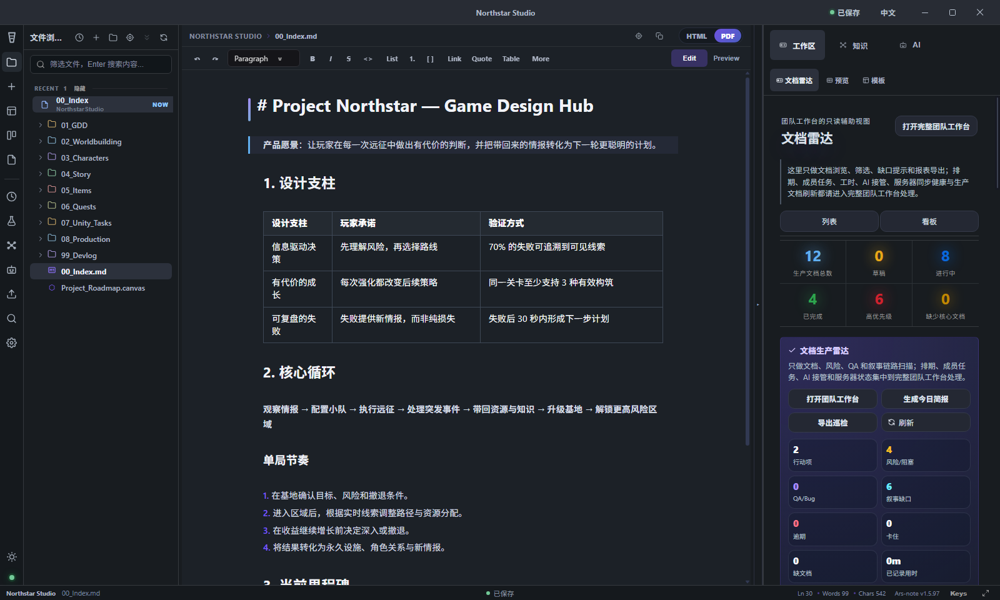
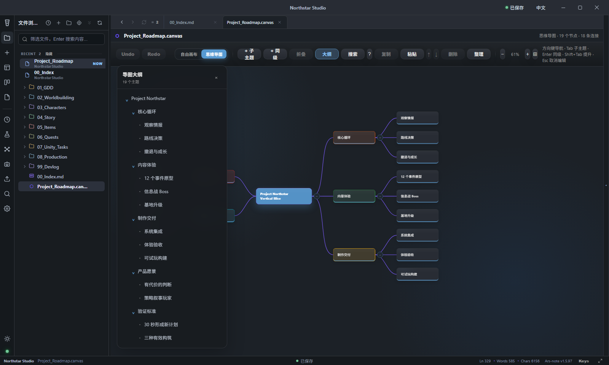
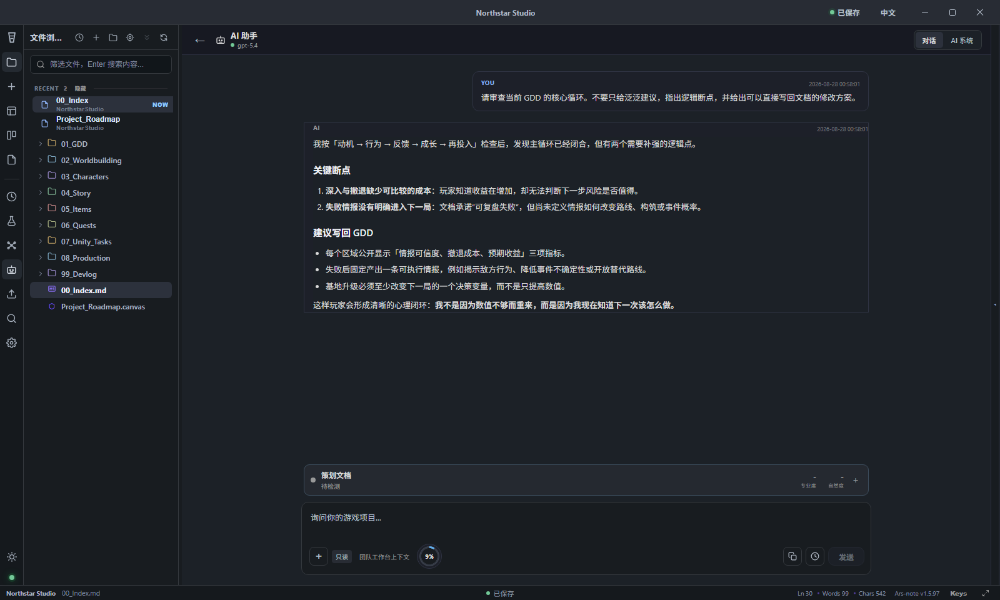

# Ars-note

Ars-note 是面向游戏开发团队的本地优先 Markdown 工作台，提供文档编辑、知识图谱、团队任务、AI 策划辅助和可自托管实时同步。

[免费下载 Windows 版本](https://github.com/TaylliSun/Ars-note/releases/latest) · [问题反馈](https://github.com/TaylliSun/Ars-note/issues) · [安全说明](SECURITY.md)

## 产品预览

<p align="center">
  <a href="docs/images/ars-note-workspace.png">
    
  </a>
</p>

<p align="center"><sub>本地 GDD 编辑、文件导航、Live Preview 与项目文档雷达集中在同一个工作区。</sub></p>

<table>
  <tr>
    <th width="50%">思维导图</th>
    <th width="50%">AI 策划助手</th>
  </tr>
  <tr>
    <td>
      <a href="docs/images/ars-note-mind-map.png">
        
      </a>
    </td>
    <td>
      <a href="docs/images/ars-note-ai-assistant.png">
        
      </a>
    </td>
  </tr>
  <tr>
    <td>双向分支、自动整理、搜索、大纲和键盘创作。</td>
    <td>结合当前 GDD 和团队上下文进行专业审查与修改建议。</td>
  </tr>
</table>

## 支持平台

- Windows 10/11 x64
- 自托管同步服务器：Node.js 22 或 Docker

## 核心能力

- 本地 Vault 与 Markdown 编辑、预览、表格和 Canvas
- 面向系统策划、数值策划、关卡、剧情、技术策划等岗位的 AI 辅助
- 团队时间表、任务文档、工时和制作健康状态
- 多设备实时文件同步、删除同步、版本历史与服务器快照
- 本地备份和自托管 NAS 服务器

## 安装

1. 下载 `Ars-note-Setup-1.5.97.exe`。
2. 校验发布页提供的 SHA256。
3. 运行安装程序并选择安装目录。
4. 首次启动后创建或打开一个 Vault。

Windows 安装包在未配置代码签名证书时会显示 SmartScreen 提示。公开正式发行前应使用可信代码签名证书签名。

## 数据与网络

- 不启用同步和 AI 时，Vault 内容保留在本机。
- 启用自托管同步后，所选 Vault 文件会发送到用户配置的服务器。
- 启用 AI 后，请求内容及相关文档上下文会发送到用户配置的 AI 服务商。
- Ars-note 本身不内置遥测或广告追踪。

详细说明见 [PRIVACY.md](PRIVACY.md) 和 [SECURITY.md](SECURITY.md)。

## 自托管同步

NAS 发布包包含可直接运行的 `server/dist` 和 `docker-compose.nas.yml`。

```powershell
Copy-Item .env.example .env
# 在 .env 中设置至少 32 个随机字符的 ARS_NOTE_SERVER_API_KEY
docker compose -f docker-compose.nas.yml up -d
```

公网部署不能直接暴露 `8787`，必须使用 HTTPS/WSS 反向代理和 `docker-compose.public.yml`。完整步骤见 [公网同步部署](PUBLIC_DEPLOYMENT.md)。

客户端只填写服务器根地址，例如：

```text
http://NAS_IP:8787
```

不要追加 `/admin`。公开互联网部署应配置 HTTPS，优先使用 Tailscale、可信 VPN 或受控反向代理，不建议直接暴露端口。

## 开发与验证

```powershell
npm install
npm run typecheck
npm test
npm --prefix server test
npm run release:full
```

构建说明见 [BUILD.md](BUILD.md)。

## 发布状态

`v1.5.97` 是当前公开测试版。Windows 安装包暂未进行 Authenticode 签名，因此首次下载运行时可能出现 SmartScreen 提示。重要项目请继续保留独立备份，并在升级同步服务器前备份 `sync-data`。

## 许可证

Ars-note 采用 [GNU General Public License v3.0](LICENSE) 发布，SPDX 标识为 `GPL-3.0-only`。
